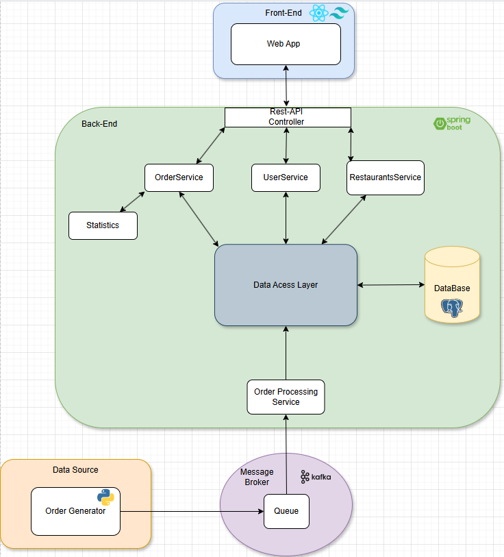

# Food Flow

## Project Abstract
This application enables users to view the most ordered menus, monitor real-time order statuses, request managerial access to add and manage their restaurants, and explore the most popular food chains and restaurants. By providing live data on sales and order progression, the app enhances customer experience and assists restaurant managers in making informed decisions based on current usage trends.


## Project Team
* **Team manager**: 114547 - João Monteiro
* **Product owner**: 113278 - Jorge Domingues
* **Architect**: 113144 - João Viegas 
* **DevOps master**: 113893 - Guilherme Santos

## Architecture Diagram


## Bookmarks
- [📄 API Documentation](https://github.com/detiuaveiro/ies-24-25-group-project-203/blob/main/docs/api/API_Documentation.md)  
  Detailed information about API endpoints, request/response structures, and usage examples.
- [📄 Project Specification Report](https://github.com/detiuaveiro/ies-24-25-group-project-203/blob/main/docs/reports/IES%20Project%20Specification%20Report.pdf )
  Project Report with detailed information about what the project is and for who; what is it's architecture and how does it work
- [📐 Figma Prototype](https://www.figma.com/design/uaQ1lduS3mzoQL4Oe7M4Cu/Untitled?node-id=0-1&t=BszxMa7s5rsk1oUO-1)  
  Figma Prototype of the frontend


## Running the project
### Accessing the production environment
Our application is running at [http://deti-ies-08.ua.pt:5173/](http://deti-ies-08.ua.pt:5173/)  
*(Accessible only within the UA network or via VPN)*

### Running locally
If running the application locally, it is accessible in [localhost:5173/](localhost:5173/)  
#### 1. Enter the project folder
```bash
cd proj
```
#### 2. Run the containers environment
```bash
docker compose up --build -d
```
#### 3. ShutDown the Application
```bash
docker compose down
```
#### 4. Clean volumes (if necessary)
```bash
docker volume rm proj_postgres_data
docker volume rm proj_datagenerator_data
```
