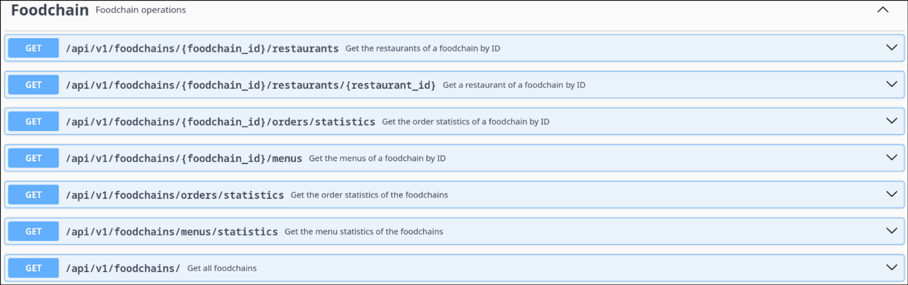
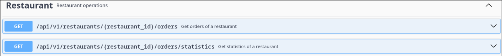
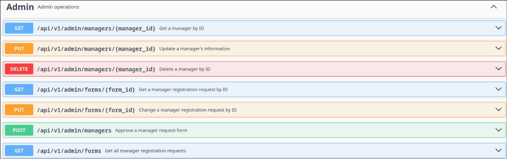
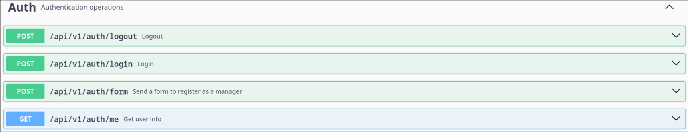

# API Documentation
## FoodChains


## Restaurants


## Admin


## Authentication


### The full documentation is available on:
http://deti-ies-08.ua.pt:8080/swagger-ui/index.html

### If you want to run this locally, to see it, you need to run the application first
```bash
cd proj
docker compose up --build -d
```

### Then access:
http://localhost:8080/swagger-ui/index.html